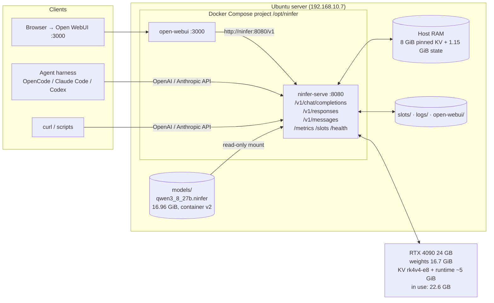
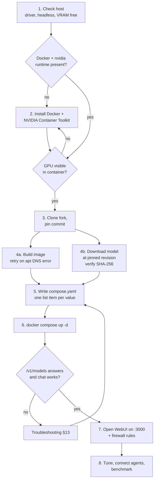
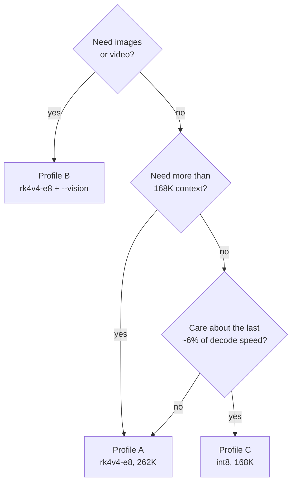
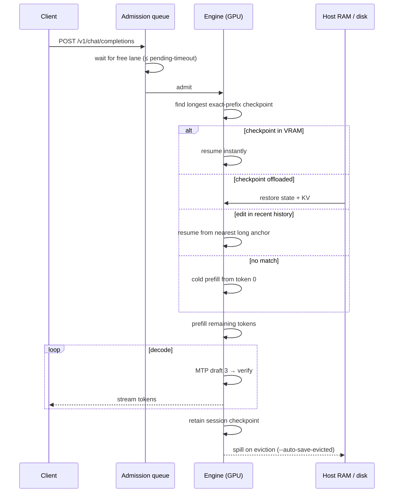

# NInfer on RTX 4090: Setup Guide (Ubuntu)

Serve **Qwen3.8-27B** on a single **RTX 4090 (24 GB)** with the full native 262K context, MTP speculative decoding, an OpenAI/Anthropic-compatible API, and a web chat client.

| Item | Value |
|---|---|
| Engine | [sergiuszm/ninfer-4090](https://github.com/sergiuszm/ninfer-4090), an `sm_89` fork of [Neroued/ninfer](https://github.com/Neroued/ninfer), commit `1bd56c9a` (v0.6.1, branch `rtx4090-port`) |
| Model | [neroued/Qwen3.8-27B-NInfer](https://huggingface.co/neroued/Qwen3.8-27B-NInfer) **at revision `35269130`** (container v2, 16.96 GiB). Not `main` — see [Step 4](#7-step-4-download-the-model) |
| Client | [Open WebUI](https://github.com/open-webui/open-webui) in the same Compose project, port 3000 |
| Tested on | Ubuntu 26.04.1, kernel 7.0, driver 595.91.07, Docker 5.x Compose, RTX 4090, 61 GB RAM, i9-13900K |
| Method | Docker Compose |
| Measured speed | 155 tok/s on code with thinking off, 114 tok/s on prose with thinking on, prefill ~190–260 tok/s on short prompts, TTFT ~115 ms |

> **About this revision.** This is the original September 2026 guide, rewritten after a real install on 2026-09-16. Two things in the original no longer work as written: the model download script now fetches an artifact format the fork cannot read, and `ninfer-serve` rejects the `--flag=value` syntax the original Compose file used. Both are fixed below. Everything else was verified step by step.

---

## 1. Architecture



Port 8080 is API only. There is no page at `/` (a browser shows HTTP 404 there); the chat page is port 3000.

---

## 2. Prerequisites

| Requirement | Why |
|---|---|
| RTX 4090 24 GB | The fork is compiled for `sm_89` (Ada) only |
| **Headless GPU** | The 262K profile leaves ~1.4 GiB of slack. Check with `nvidia-smi`: memory used should be a few MiB with no processes listed. A running display manager is fine only if it is not on the 4090 |
| NVIDIA driver **580+** | The container uses CUDA 13.1. Verified on 595.91.07 |
| Docker Engine + Compose v2+ + NVIDIA Container Toolkit | Build and run path. Check with `docker info \| grep -i runtimes`; if `nvidia` is listed you can skip §5.2 |
| Disk: ~50 GB free | 17 GB model, 5.2 GB engine image, ~4 GB Open WebUI image, build cache, saved sessions. Add 20 GB if you keep the v3 artifact for later |
| Host RAM: 32 GB+ | The server pins ~9 GiB of host memory at start (KV spill + checkpoint slots) |
| Network access to GitHub, Docker Hub, ghcr.io and Hugging Face | Source, base images, model. On a ~10 MB/s link budget **about 90 minutes** of downloads in total |

---

## 3. Setup flow



Steps 4a and 4b are independent and slow. Run them in parallel and detached from your shell (`setsid nohup … &`) so a dropped SSH session or a tool timeout does not kill them.

---

## 4. Step 1: Prepare the host

### 4.1 Confirm the GPU is free

```bash
nvidia-smi --query-gpu=driver_version,memory.used --format=csv,noheader
systemctl is-active display-manager gdm gdm3 lightdm sddm
```

You want driver ≥ 580, memory used near `1 MiB`, and every display manager `inactive`. If a desktop holds VRAM on the 4090:

```bash
sudo systemctl set-default multi-user.target
sudo reboot
```

If a display is needed, attach it to the iGPU, never to the 4090.

### 4.2 Install the NVIDIA driver (only if below 580)

```bash
sudo apt update
ubuntu-drivers list
sudo apt install -y nvidia-driver-580-open   # or newer
sudo reboot
```

### 4.3 Optional: cap GPU power

Decode is memory-bandwidth bound, so a cap costs little. Not applied in this install; the server drew ~126 W idle-resident and stayed at 45 °C between requests.

```bash
sudo nvidia-smi -pm 1
sudo nvidia-smi -pl 350   # watts; stock 450. Resets on reboot.
```

---

## 5. Step 2: Docker and the NVIDIA Container Toolkit

### 5.1 Check first

```bash
docker compose version
docker info | grep -iE "runtimes|default runtime"
dpkg -l nvidia-container-toolkit | tail -1
id -nG | grep -w docker
```

If Compose is v2+, the runtimes line lists `nvidia`, the package is installed and you are in the `docker` group, skip to §5.3. (On this box all four were already true because a `dcgm-exporter` container was running.)

### 5.2 Install if missing

```bash
curl -fsSL https://get.docker.com | sudo sh
sudo usermod -aG docker $USER
newgrp docker

curl -fsSL https://nvidia.github.io/libnvidia-container/gpgkey \
  | sudo gpg --dearmor -o /usr/share/keyrings/nvidia-container-toolkit-keyring.gpg
curl -s -L https://nvidia.github.io/libnvidia-container/stable/deb/nvidia-container-toolkit.list \
  | sed 's#deb https://#deb [signed-by=/usr/share/keyrings/nvidia-container-toolkit-keyring.gpg] https://#g' \
  | sudo tee /etc/apt/sources.list.d/nvidia-container-toolkit.list
sudo apt-get update
sudo apt-get install -y nvidia-container-toolkit
sudo nvidia-ctk runtime configure --runtime=docker
sudo systemctl restart docker
```

### 5.3 Check GPU access from a container

```bash
docker run --rm --gpus all nvidia/cuda:13.1.2-runtime-ubuntu24.04 nvidia-smi
```

The 4090 must be listed. This also pre-pulls part of the base image the build needs.

---

## 6. Step 3: Get the source and build the image

```bash
sudo mkdir -p /opt/ninfer && sudo chown $USER:$USER /opt/ninfer
cd /opt/ninfer
git clone https://github.com/sergiuszm/ninfer-4090.git
cd ninfer-4090
git log --oneline -1                      # this guide: 1bd56c9a on rtx4090-port
git rev-parse HEAD > ../PINNED_COMMIT
```

Build detached, because on a slow link the 2.14 GB `cuda:13.1.2-devel` base pull plus compile takes 20–40 minutes:

```bash
cat > /opt/ninfer/run-build.sh <<'EOF'
#!/bin/bash
cd /opt/ninfer/ninfer-4090 || exit 1
docker build --tag ninfer-4090:sm89 . > /opt/ninfer/build.log 2>&1 \
  && docker tag ninfer-4090:sm89 "ninfer-4090:$(cut -c1-8 /opt/ninfer/PINNED_COMMIT)" \
  && echo BUILD_OK >> /opt/ninfer/build.log || echo BUILD_FAILED >> /opt/ninfer/build.log
EOF
chmod +x /opt/ninfer/run-build.sh
setsid nohup /opt/ninfer/run-build.sh >/dev/null 2>&1 < /dev/null &
tail -f /opt/ninfer/build.log        # Ctrl-C to stop watching; the build continues
```

> **If the build fails at `apt-get install` with `Package 'cmake' has no installation candidate`**, scroll up: it is almost always `Could not resolve 'archive.ubuntu.com'`, a transient DNS failure inside the build container. Just rerun `run-build.sh`; the base image is cached and the retry takes a few minutes. This happened on the first attempt here.

> **About the Dockerfile.** It removes `/usr/local/cuda*/compat` from the runtime image. Those forward-compatibility libraries only work on datacenter GPUs and break startup on GeForce (`cudaErrorCompatNotSupportedOnDevice`). Leave that line alone.

The finished image is 5.15 GB. Confirm it runs:

```bash
docker run --rm ninfer-4090:sm89 ninfer-serve --help | head -3
```

---

## 7. Step 4: Download the model

### 7.1 Why not the fork's download script

`scripts/download-qwen38.sh` fetches `resolve/main/qwen3_8_27b.ninfer`. On 2026-09-15 the model repo republished `main` as a **container version 3** artifact (20.4 GB, header `NINFER\0\x03`). The fork at `1bd56c9a` reads **version 2 only** and fails at startup with:

```
FATAL server failed during startup | artifact magic is not NInfer v2
```

The fork's own model card (`model-cards/Qwen3.8-27B-NInfer/`) pins the v2 artifact:

| Field | Value |
|---|---|
| Hugging Face revision | `35269130` (2026-08-14) |
| Size | 18,210,531,328 bytes (16.96 GiB) |
| SHA-256 | `eec39564993d6e9c7d5e383382a760f093465c9d163ec9a1bd6b80199514bf3e` |
| Required upstream commit | `52320554`, present in the fork's history |

The 2026-09-06 revision `dc370fb6` is also v2 but needs upstream `385b30ce`, which the fork does not contain. Use `35269130`.

### 7.2 Download the pinned revision

```bash
mkdir -p /opt/ninfer/models
echo 35269130 > /opt/ninfer/MODEL_REVISION
printf 'eec39564993d6e9c7d5e383382a760f093465c9d163ec9a1bd6b80199514bf3e  qwen3_8_27b.ninfer\n' > /opt/ninfer/SHA256SUMS

cat > /opt/ninfer/run-download-v2.sh <<'EOF'
#!/bin/bash
cd /opt/ninfer/models || exit 1
if curl -L -C - --fail --output qwen3_8_27b.ninfer \
  'https://huggingface.co/neroued/Qwen3.8-27B-NInfer/resolve/35269130/qwen3_8_27b.ninfer' > /opt/ninfer/download.log 2>&1 \
  && sha256sum -c /opt/ninfer/SHA256SUMS >> /opt/ninfer/download.log 2>&1; then
  echo DOWNLOAD_OK >> /opt/ninfer/download.log
else
  echo DOWNLOAD_FAILED >> /opt/ninfer/download.log
fi
EOF
chmod +x /opt/ninfer/run-download-v2.sh
setsid nohup /opt/ninfer/run-download-v2.sh >/dev/null 2>&1 < /dev/null &
```

`curl -C -` resumes, so rerun the script if it is interrupted. At ~11 MB/s the download took 26 minutes. The last lines of `download.log` must read `qwen3_8_27b.ninfer: OK` and `DOWNLOAD_OK`.

### 7.3 Sanity check the format

```bash
head -c 8 /opt/ninfer/models/qwen3_8_27b.ninfer | xxd
# 4e49 4e46 4552 0002   = "NINFER" + version 2  ✅
# 4e49 4e46 4552 0003   = version 3, this fork cannot load it
```

If you already downloaded `main`, keep it as `qwen3_8_27b.v3.ninfer` for when the fork merges upstream's v3 support (upstream added it on 2026-09-15).

---

## 8. Step 5: Choose a profile

On 24 GB, KV precision, vision, and context length compete for the same memory:

| Profile | `--kv-dtype` | Context | Vision | Startup slack | Use when |
|---|---|---:|:---:|---:|---|
| **A. Full context (installed)** | `rk4v4-e8` | 262,144 | – | ~1.4 GiB | Long agent sessions, text only |
| B. Full context + vision | `rk4v4-e8` | 262,144 | ✅ 8K scratchpad | ~780 MiB | Clients that send screenshots or charts |
| C. Max precision | `int8` | 172,032 | – | ~136 MiB | ~6% faster decode, highest KV fidelity |
| D. Extra slack | `rk2v4-e8` | 262,144 | – | ~2.4 GiB | Room for a second lane; ~10% decode cost |

Profile A measured here: 22,592 MiB in use out of 24,564 after start.



---

## 9. Step 6: Run with Docker Compose

```bash
mkdir -p /opt/ninfer/slots /opt/ninfer/logs /opt/ninfer/open-webui
nano /opt/ninfer/compose.yaml
```

> **`ninfer-serve` rejects `--flag=value`** (`unknown argument: --host=0.0.0.0`) and prints its usage in a restart loop. Every value must be its own list item, as below.

```yaml
services:
  ninfer:
    image: ninfer-4090:sm89
    container_name: ninfer
    restart: unless-stopped
    ports:
      - "8080:8080"
    volumes:
      - /opt/ninfer/models:/workspace/models:ro
      - /opt/ninfer/slots:/workspace/slots
      - /opt/ninfer/logs:/workspace/logs
    deploy:
      resources:
        reservations:
          devices:
            - driver: nvidia
              count: 1
              capabilities: [gpu]
    stop_grace_period: 30s
    command:
      - ninfer-serve
      - models/qwen3_8_27b.ninfer
      - --host
      - "0.0.0.0"
      - --port
      - "8080"
      # --- context / KV (Profile A) ---
      - --max-context
      - "262144"
      - --kv-capacity
      - "262144"
      - --kv-dtype
      - rk4v4-e8
      - --prefill-chunk
      - "1024"
      # --- speculative decoding ---
      - --spec
      - mtp
      - --draft-tokens
      - "3"
      - --lm-head-draft
      # --- serving / queue ---
      - --max-concurrency
      - "1"
      - --max-pending-requests
      - "16"
      - --pending-timeout-ms
      - "600000"
      - --preserve-thinking
      # --- session persistence ---
      - --slot-save-path
      - /workspace/slots
      - --auto-save-evicted
      # --- diagnostics ---
      - --request-log-jsonl
      - /workspace/logs/requests.jsonl
      # --- Profile B: uncomment for vision ---
      # - --vision

  open-webui:
    image: ghcr.io/open-webui/open-webui:main
    container_name: open-webui
    restart: unless-stopped
    ports:
      - "3000:8080"
    volumes:
      - /opt/ninfer/open-webui:/app/backend/data
    environment:
      OPENAI_API_BASE_URL: http://ninfer:8080/v1
      OPENAI_API_KEY: none            # must be non-empty; NInfer ignores it
      ENABLE_OLLAMA_API: "false"
      WEBUI_NAME: "Homelab LLM (RTX 4090)"
    depends_on:
      - ninfer
```

Start the engine first and watch it come up:

```bash
cd /opt/ninfer
docker compose config --quiet && echo valid
docker compose up -d ninfer
docker compose logs -f ninfer
```

Expected startup log (6 seconds total here):

```
INFO  loading weights | 16.7 GiB
INFO  weights ready | 16.7 GiB | 3.2s | 5.24 GiB/s
INFO  pinning host state | 1.15 GiB
INFO  pinning host KV | 8.00 GiB
INFO  CUDA graphs ready | 744 ms
INFO  engine ready | qwen3.8-27b/groupwise-int | total 6.0s
INFO  listening on http://0.0.0.0:8080 | model qwen3.8-27b | auth disabled
```

Before it listens, the server checks that the configured context fits and exits with the exact shortfall if not.

Then the client (the image is ~4 GB; on a slow link the pull takes 10+ minutes and the port refuses connections until it finishes):

```bash
docker compose up -d open-webui
docker compose logs -f open-webui
```

### Firewall

```bash
sudo ufw allow from 192.168.10.0/24 to any port 8080 proto tcp comment "ninfer-serve"
sudo ufw allow from 192.168.10.0/24 to any port 3000 proto tcp comment "Open WebUI"
```

---

## 10. Step 7: Verify

### 10.1 Smoke tests

```bash
# Model list; must report context_window: 262144
curl -s http://127.0.0.1:8080/v1/models | jq

# Short request, thinking off
curl -s http://127.0.0.1:8080/v1/chat/completions \
  -H 'Content-Type: application/json' \
  -d '{
    "model": "qwen3.8-27b",
    "messages": [{"role": "user", "content": "Write a Python function that reverses a linked list."}],
    "max_tokens": 512,
    "enable_thinking": false
  }' | jq '{content: .choices[0].message.content, timings}'

# Thinking on, low effort; reasoning arrives in message.reasoning_content
curl -s http://127.0.0.1:8080/v1/chat/completions \
  -H 'Content-Type: application/json' \
  -d '{"model":"qwen3.8-27b","messages":[{"role":"user","content":"What is 17 * 23?"}],"reasoning_effort":"low"}' \
  | jq '{answer: .choices[0].message.content, reasoning_tokens: .usage.completion_tokens_details.reasoning_tokens, tps: .timings.predicted_per_second}'
```

`timings` reports `predicted_per_second`, `prompt_per_second`, `prompt_ms` (TTFT), `cache_n` (prefix-cache hits) and `draft_n` / `draft_n_accepted`.

### 10.2 Measured on this install

| Workload | Decode | Draft acceptance |
|---|---:|---:|
| Code, thinking off, 148–600 tokens | 153–155 tok/s | 83–85% |
| Arithmetic, thinking on, `low` | 163 tok/s | 93% |
| Prose, thinking on, `medium`, 519 tokens | 114 tok/s | 54% |
| Average over the first 16 requests | 122 tok/s | |

Prefill on short prompts: 190–260 tok/s (dominated by fixed cost; the fork quotes 1.2–2.0K tok/s on long prompts). TTFT ~115 ms. Expect decode to fall toward 65–100 tok/s past 100K tokens of context, per the fork's own measurements.

### 10.3 Monitoring endpoints

```bash
curl -s http://127.0.0.1:8080/health
curl -s http://127.0.0.1:8080/metrics | grep -E 'llamacpp:|ninfer:'
curl -s http://127.0.0.1:8080/slots | jq
nvidia-smi --query-gpu=memory.used,memory.total,power.draw,temperature.gpu --format=csv -l 5
```

`/metrics` uses llama.cpp-compatible names, so existing Prometheus scrapers and llama-swap work unchanged.

---

## 11. Step 8: Clients

### 11.1 Open WebUI (browser)

Open `http://<server>:3000`. The first visit shows a sign-up form; that account becomes the local admin. `qwen3.8-27b` is fetched from NInfer automatically, and the model's thinking renders as a collapsible block above each answer. Data stays in `/opt/ninfer/open-webui/`.

Update it with `docker compose pull open-webui && docker compose up -d open-webui`.

### 11.2 API clients and agent harnesses

| Topic | What to do |
|---|---|
| Base URL | `http://<server>:8080/v1` (OpenAI Chat Completions and Responses), `http://<server>:8080/v1/messages` (Anthropic) |
| Model name | `qwen3.8-27b` |
| Thinking on/off | Top-level `"enable_thinking": false`. **`chat_template_kwargs` is rejected**, which is how llama.cpp and vLLM clients usually do it. Any client that sends it must be changed |
| `reasoning_effort` | Only `low`, `medium`, `xhigh`, `none`. **Map `high` → `xhigh`** or the request is rejected |
| Thinking budget | Anthropic `thinking.budget_tokens`, or server flag `--default-thinking-budget` |
| `max_tokens` | Works. Default cap 8192 (`--default-max-tokens`) |
| Reasoning in responses | Non-streaming: `message.reasoning_content`; `usage.completion_tokens_details.reasoning_tokens` counts it |
| Tool calls | Parsed and returned; NInfer does not execute tools |
| Streaming errors | Arrive as an in-band SSE error event **after HTTP 200**. A client that ignores them sees streams ending with no `finish_reason` |
| Prompt caching | Keep the start of prompts byte-stable. A timestamp in the system prompt invalidates the whole cache |

### 11.3 Request lifecycle



---

## 12. Tuning

| Flag | Default | Recommendation |
|---|---|---|
| `--pending-timeout-ms` | 30000 | **600000**, already set. Deep prefills take minutes; at the default, parallel agents fail with `request_queue_timeout` |
| `--max-concurrency` | 1 | Try 2: ~390 MiB more VRAM, ~1.5× total decode, KV pool still shared so one session keeps full context. Untested here; >2 untested on the 4090 |
| `--auto-long-anchors` / `--max-long-anchors-per-continuation` | 2 / 2 | Covers ~99.8% of agent turns. Raise both only for clients that edit deep history |
| `--host-state-slots` | 8 | Size to `continuations × (2 + anchors)`; ~147 MiB host RAM each |
| `--prefill-chunk` | 1024 | Keep ≤ 2688; larger is not faster |
| `--vision-max-tokens` | 8192 | One 1024×1024 image ≈ 1,026 tokens; each extra 1,024 tokens ≈ 62 MiB VRAM |

> **Concurrency caveat.** Prefill runs one lane at a time and stalls decode on every lane. A short request queued behind a 31K-token cold prefill waited 13.5 s for its first token in the fork's tests.

### Session persistence

```bash
curl -X POST 'http://127.0.0.1:8080/slots/0?action=save' \
  -H 'Content-Type: application/json' -d '{"filename": "agent-main.bin"}'
curl -X POST 'http://127.0.0.1:8080/slots/0?action=restore' \
  -H 'Content-Type: application/json' -d '{"filename": "agent-main.bin"}'
```

See the fork's `docs/serving.md` for the `if_digest` precondition. Slot files may not load across engine versions; treat them as cache.

---

## 13. Troubleshooting

| Symptom | Likely cause | Fix |
|---|---|---|
| `artifact magic is not NInfer v2` at startup, container restart-loops | Model downloaded from HF `main` (container v3) | Download revision `35269130` (§7). Check the header with `head -c 8 … \| xxd` |
| `unknown argument: --host=0.0.0.0`, usage text in the log | `--flag=value` form in Compose | One list item per flag and per value (§9) |
| Build fails: `Package 'cmake' has no installation candidate` | `Could not resolve 'archive.ubuntu.com'` inside the build container | Rerun the build; base image is cached |
| Browser shows HTTP 404 at `http://<server>:8080/` | Expected: NInfer has no web page | Use `:3000` for chat, `:8080/v1/models` for the API |
| `ERR_CONNECTION_REFUSED` on `:3000` | Open WebUI image still pulling, or firewall | `docker ps`, `docker compose logs open-webui`, `sudo ufw status` |
| `cudaErrorCompatNotSupportedOnDevice` | CUDA compat libs on a GeForce card | Use the fork's Dockerfile unchanged |
| Exits at startup with a memory deficit | Something else holds VRAM, or profile too big | `nvidia-smi`, stop other processes, go headless, or drop to `rk2v4-e8` |
| `could not select device driver "nvidia"` | Container toolkit not configured | `sudo nvidia-ctk runtime configure --runtime=docker && sudo systemctl restart docker` |
| `request_queue_timeout` | Queue deadline shorter than prefill | `--pending-timeout-ms 600000` |
| `reasoning_effort_not_supported` | Client sent `high`, `minimal`, `max` | Map to `low` / `medium` / `xhigh` / `none` |
| Request rejected for `chat_template_kwargs` | llama.cpp-style field | Use top-level `enable_thinking` |
| `media_budget_exceeded` | Too many image tokens | Raise `--vision-max-tokens` or send fewer/smaller images |
| Every turn does a full cold prefill | Prompt start changes each turn | Keep the system prompt stable; check `prefix_reuse_path` in `requests.jsonl` |
| Streams end with no `finish_reason` | In-band SSE error the client did not parse | Read the stream's error events or the server log |
| Decode much slower than expected | Low draft acceptance (prose, high temperature) or throttling | Check `draft_n_accepted/draft_n`, temperature, `nvidia-smi` power/thermals |

---

## 14. Updating and rollback

```bash
cd /opt/ninfer/ninfer-4090
git fetch && git log --oneline HEAD..origin/rtx4090-port   # review first
git pull
git rev-parse HEAD > ../PINNED_COMMIT
/opt/ninfer/run-build.sh          # tags ninfer-4090:sm89 and ninfer-4090:<commit8>
cd /opt/ninfer && docker compose up -d ninfer
```

To roll back, set `image:` in `compose.yaml` to the previous `ninfer-4090:<commit8>` tag and `docker compose up -d ninfer`.

**When the fork gains container-v3 support** (upstream `Neroued/ninfer` added it on 2026-09-15), the `main` artifact becomes usable: drop `qwen3_8_27b.v3.ninfer` in as `qwen3_8_27b.ninfer`, update `SHA256SUMS`, restart. Until then keep the v2 pin.

---

## 15. Alternative: native build (no Docker)

For Ubuntu with CUDA Toolkit 12.8+ on the host. Not exercised in this install; kept from the original guide.

```bash
sudo apt-get install -y build-essential gcc-13 g++-13 cmake ninja-build pkg-config \
  libavcodec-dev libavformat-dev libavutil-dev libswscale-dev libcurl4-openssl-dev
export CC=/usr/bin/gcc-13 CXX=/usr/bin/g++-13
export CUDACXX=/usr/local/cuda/bin/nvcc CUDAHOSTCXX=/usr/bin/g++-13
cd /opt/ninfer/ninfer-4090
cmake -S . -B build-sm89 -G Ninja -DCMAKE_BUILD_TYPE=Release \
  -DCMAKE_C_COMPILER="$CC" -DCMAKE_CXX_COMPILER="$CXX" \
  -DCMAKE_CUDA_COMPILER="$CUDACXX" -DCMAKE_CUDA_HOST_COMPILER="$CUDAHOSTCXX" \
  -DCMAKE_CUDA_ARCHITECTURES=89 \
  -DNINFER_BUILD_APPS=ON -DBUILD_TESTING=OFF -DNINFER_BUILD_BENCHMARKS=OFF
cmake --build build-sm89 --parallel
./build-sm89/apps/ninfer-serve --help
```

Note that Ubuntu 26.04's glibc 2.43 declares C23 `rsqrt` in a way CUDA ≤ 13.1 headers reject; the llama.cpp setup in this repo works around it with a shadowed `bits/mathcalls.h`. Expect the same for a native NInfer build on 26.04. Docker avoids the issue entirely.

---

## 16. Known limits

- One GPU, one model, one process. No multi-GPU, weight offload, or request preemption.
- Prefill is ~16–24% slower than llama.cpp on 32K–128K prompts. Decode is where NInfer wins.
- Only `--max-concurrency` 1 and 2 are measured on the 4090 by the fork; only 1 here.
- Context is capped at 262K. YaRN extension to 1M is not documented for NInfer.
- The E8 4-bit KV mode is validated with retrieval tests up to 260K, not with reasoning benchmarks at depth.
- Text only on Profile A. Vision (Profile B) was not exercised in this install.
- Community fork chain (5090 → 3090 → 4090) with no stable releases, and the model repo can change format under you, as it did on 2026-09-15. **Pin the engine commit and the model revision.**

---

## References

- Upstream engine: https://github.com/Neroued/ninfer
- RTX 4090 fork: https://github.com/sergiuszm/ninfer-4090
- Fork vs llama.cpp comparison: https://github.com/sergiuszm/ninfer-4090/blob/main/docs/llamacpp-comparison.md
- Model artifact (pin revision `35269130`): https://huggingface.co/neroued/Qwen3.8-27B-NInfer/tree/35269130
- Qwen3.8-27B model card: https://huggingface.co/Qwen/Qwen3.8-27B
- Open WebUI: https://github.com/open-webui/open-webui
- Install record and live compose file for this box: [README.md](./README.md), [compose.yaml](./compose.yaml)
